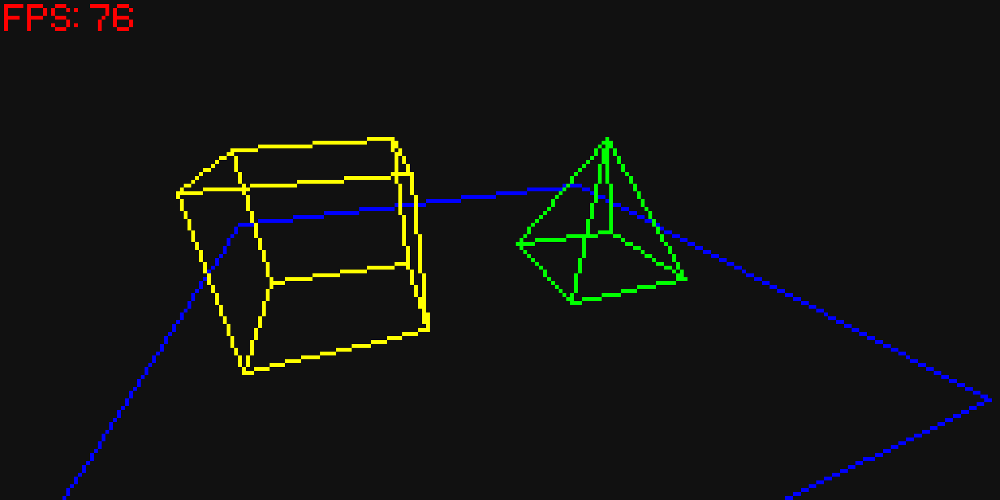
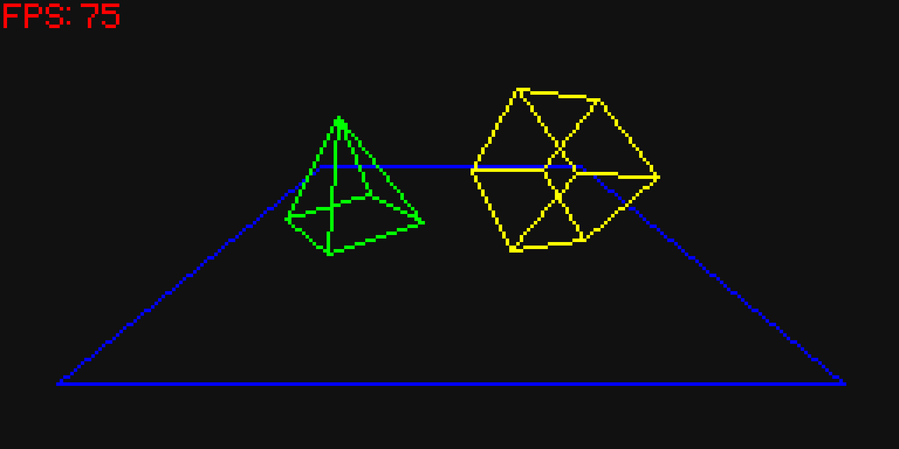

# javascript-3d

A 3D renderer written in JavaScript that runs on your browser

---

Here are some images of how this looks:

---

## How to use/try
Simple, visit this link:
https://slimeedude.github.io/javascript-3d/

Or alternatively:

Download this project as ZIP, extract it somewhere, then open the HTML file.

Most mobile browsers don't support opening local files anymore, so there's a chance you might have to host this on a test HTTP server.

---

## Work is still in progress!

This isn't actually a proper 3D renderer yet, and it lacks many features.

The shapes are currently drawn by connecting the projected points using a line drawing algorithm.
